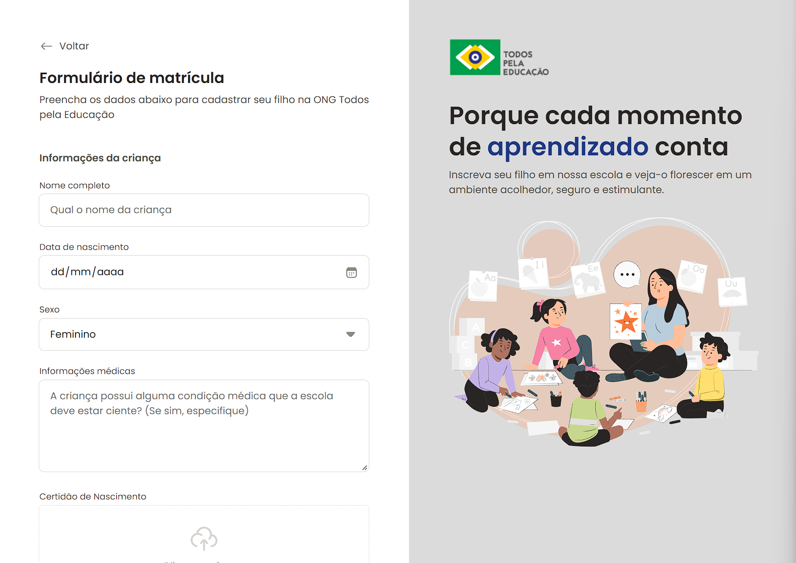

## Formulário de Matrícula - Todos pela educação

Este é um projeto de formulário de contato desenvolvido para a ONG "Todos Pela Educação". A aplicação foi construída utilizando HTML, CSS e VanillaJS (JavaScript puro) para proporcionar uma interface simples e eficiente para os usuários entrarem em contato com a ONG.

  

## Funcionalidades

- **Formulário Responsivo**: O formulário é responsivo e se adapta a diferentes tamanhos de tela, proporcionando uma boa experiência de uso em dispositivos móveis e desktops.
- **Validação de Campos**: Validação básica dos campos do formulário, garantindo que o nome, e-mail e mensagem sejam preenchidos antes do envio.
- **Feedback ao Usuário**: Mensagens de feedback ao usuário após o envio do formulário, informando se a mensagem foi enviada com sucesso ou se ocorreu algum erro.

## Funcionalidades

- **Formulário Responsivo**: O formulário é responsivo e se adapta a diferentes tamanhos de tela, proporcionando uma boa experiência de uso em dispositivos móveis e desktops.
- **Validação de Campos**: Validação básica dos campos do formulário, garantindo que o nome, e-mail e mensagem sejam preenchidos antes do envio.
- **Feedback ao Usuário**: Mensagens de feedback ao usuário após o envio do formulário, informando se a mensagem foi enviada com sucesso ou se ocorreu algum erro.

## Tecnologias Utilizadas

- **HTML**: Estrutura do formulário e da página.
- **CSS**: Estilização do formulário e da página.
- **JavaScript (VanillaJS)**: Validação dos campos e manipulação do DOM para fornecer feedback ao usuário.
